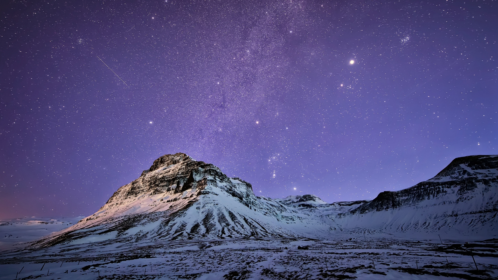
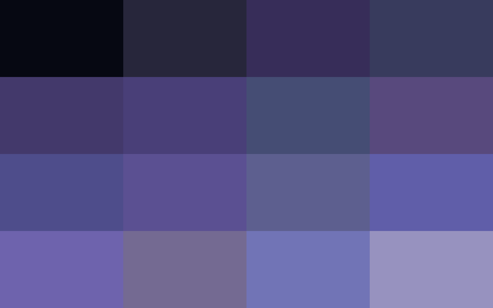
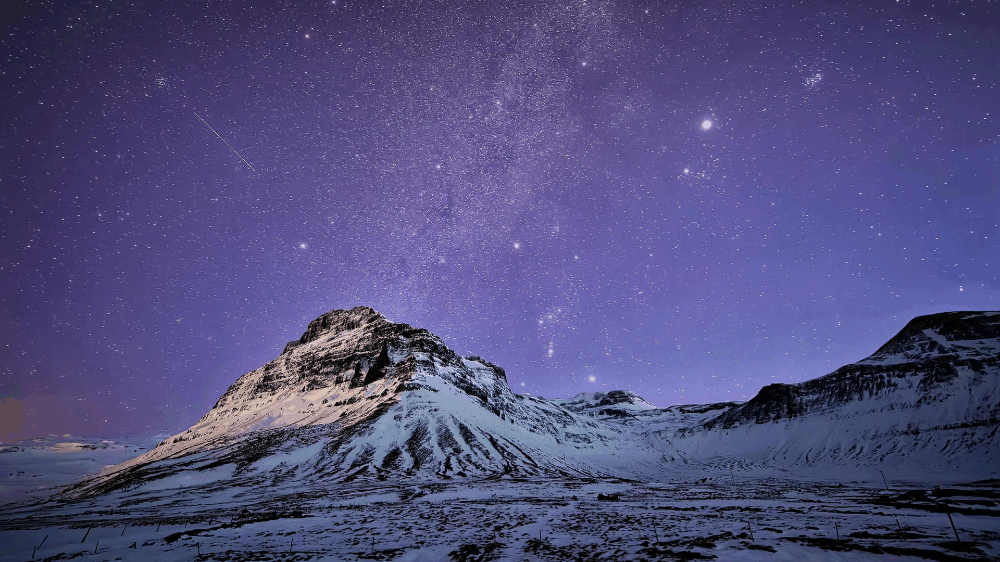

# swatch-rs


Quantize RGB color range of image to N dominant colors using [median cut](https://en.wikipedia.org/wiki/Median_cut) algorithm.

```
swatch-rs -h
swatch-rs 0.1.0
utility to quantize image to N dominant color using median cut algorithm.

USAGE:
    swatch-rs [OPTIONS] --image <image-path>

FLAGS:
    -h, --help       Prints help information
    -V, --version    Prints version information

OPTIONS:
    -d, --debug-type <debug-type>    Debug type print quantized pixels to given format. value can be (html, json or
                                     file). "file" debug type will create a "swatch.html" and write HTML data into it
    -i, --image <image-path>         Path to an image
    -c, --colors <max-depth>         Number of colors needed in power of 2, ex: for 16 colors pass 4. (i.e. 2^4 = 16)
                                     [default: 4]
    -o, --output-image <output>      [default: quantize-image.png]
```

# Download

- Download appropriate pre-compiled binary from the [release](https://github.com/urvil38/swatch-rs/releases) page.

```bash
# download tar archive using cURL
curl -L https://github.com/urvil38/swatch-rs/releases/download/v0.0.1/swatch-rs-v0.0.1-x86_64-linux.tar.gz > swatch-rs-v0.0.1-x86_64-linux.tar.gz

# untar archive
tar -xvzf swatch-rs-v0.0.1-x86_64-linux.tar.gz
cd swatch-rs

# move it to bin dir (user need to has root privileges. run following command as root user using sudo.
sudo mv ./swatch-rs /usr/local/bin
```

## Build

You can compile from source by [installing Cargo](https://crates.io/install)
([Rust's](https://www.rust-lang.org/) package manager)
and building `swatch-rs` using Cargo:

```bash
git clone https://github.com/urvil38/swatch-rs.git
cd swatch-rs
cargo build --release
```

Compilation will probably take a few minutes depending on your machine. The
binary will end up in `./target/release/swatch-rs`.

## Example

**Image: iceland.jpg - dimention: 1920 × 1080 - size: 1.1 Mib**




- following command will produce quantized image and also swatch.html file which contains top N dominant colors(sorted by luminance).

```bash
swatch-rs -i ./docs/iceland.jpg -d file -c 8 -o quantize-image.jpg
```




**Image: quantize-image.jpg - dimention: 1920 × 1080 - size: 418 Kib**


